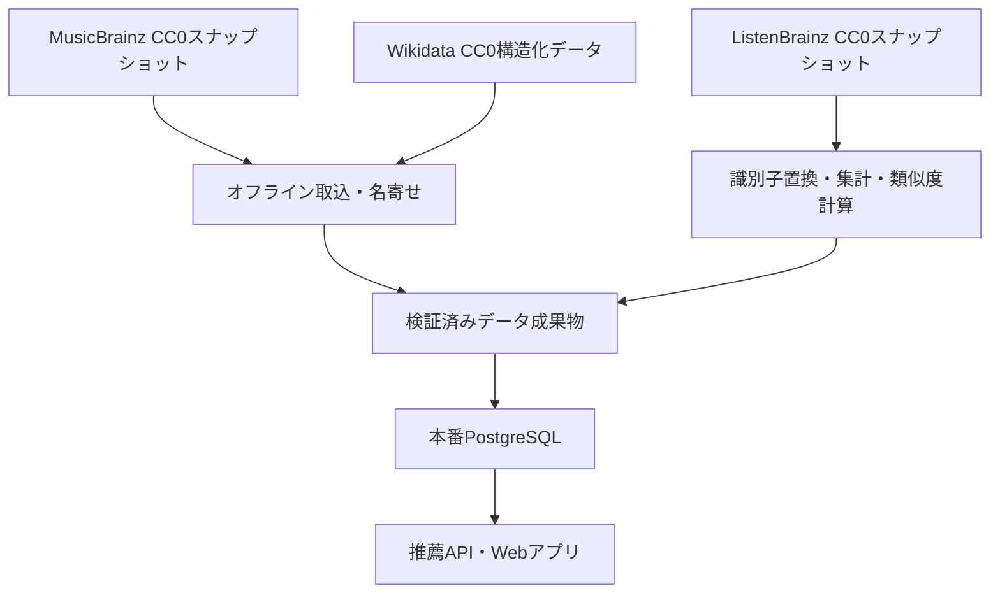
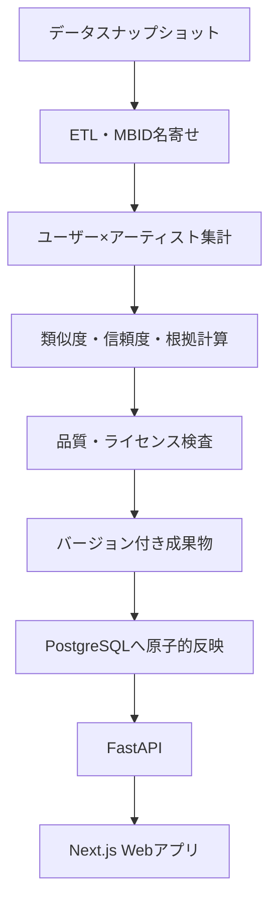

# 説明可能なアーティスト探索サービス 企画・技術・権利検証書

- 作成日：2026年8月11日
- 想定読者：開発者、協力者、就職活動での説明相手
- 仮称：Open Artist Discovery Graph（正式名称は未決定）
- 想定公開形態：まず非商用の一般公開ベータ、将来的な収益化にも移行しやすい構成

> [!IMPORTANT]
> 本書は、2026年8月11日時点の公式資料を確認して作成した企画・技術上の整理であり、個別案件に対する法律意見ではない。特に収益化、広告掲載、楽曲・歌詞・写真の利用、海外展開を始める前には、利用条件の再確認と必要に応じた専門家への相談を行う。

---

## 1. 結論

この企画は、次の形に修正すれば一般公開を目指せ、就職活動でも強い大規模プロジェクトになる。

> ユーザーが好きなアーティストを複数選ぶと、聴取傾向に基づいて未知のアーティストを推薦し、「なぜ推薦されたか」「データの信頼度はどの程度か」を確認しながら探索できるサービス。

最もよい実現方法は、以下の **CC0-first・snapshot-based構成** である。

1. MusicBrainzのCC0データを、アーティストの共通IDと基本情報に使う。
2. ListenBrainzのCC0聴取履歴ダンプをオフライン処理し、アーティスト間の類似度を自分で計算する。
3. 必要に応じてWikidataのCC0構造化データでジャンル等を補完する。
4. 計算済みのアーティスト関係だけを自分のPostgreSQLに保存する。
5. 公開サイトは自分のDBだけを参照し、外部APIを実行時には呼ばない。
6. Spotify・Last.fmは推薦モデルと必須導線から外す。
7. MVPでは楽曲、歌詞、ジャケット、アーティスト写真を掲載せず、公式サービスへの外部リンクだけを置く。

> 自分のDBへ「全部」を複製する設計ではない。本番DBに置くのは、公開に必要なアーティスト基本情報、計算済みの上位関係、根拠、データ版だけである。ListenBrainzの個人別生履歴は一時バッチ環境だけで処理し、本番へ持ち込まない。

### 公開可能性の判定

| 項目 | 判定 | 条件 |
|---|---|---|
| 非商用の一般公開 | 設計上可能 | 本書のCC0中心構成、出典表示、プライバシー対応を守り、公開直前に条件を再確認する |
| 外部API停止時の継続運用 | 可能 | 自前DBと直前の正常なデータスナップショットを使用する |
| 将来の広告・有料化 | 移行しやすい | MusicBrainzの非商用限定タグ、Last.fm、Spotify由来データを中核に混ぜず、収益化前に再審査する |
| Spotifyログインを誰でも利用 | 現時点では非現実的 | 個人開発のDevelopment Modeは認証ユーザー数等に強い制限がある |
| 楽曲・歌詞・写真の自由な掲載 | 不可 | 著作権・著作隣接権・画像ごとのライセンス処理が別途必要 |

---

## 2. 企画を再検証した結果

### 2.1 当初案のままでは弱い点

「アーティストをマップ表示して、似たアーティストを教える」だけのサービスは、すでに複数存在する。

- [Music-Map](https://www.music-map.com/)：入力したアーティストの周囲に類似アーティストを配置する。
- [Chosic Music Artists Map](https://www.chosic.com/music-artists-map/)：類似度、ジャンル、人気度、プレビューを含むマップを提供する。
- [similar-artists.com](https://similar-artists.com/)：リスナー嗜好に基づくアーティストマップを提供しており、「Artist Atlas」という表現も既に使われている。
- SpotifyもTaste ProfileやRelease Radarで、ユーザーの嗜好を使った推薦や一部の探索方向の調整を提供している。

そのため、単なるマップや「もっとマイナー」スライダーだけでは、独自性が十分ではない。

### 2.2 採用する差別化

本サービスの中心価値は、マップではなく **説明可能で操作可能な発見過程** に置く。

#### 主要な差別化機能

1. **複数シード推薦**  
   好きなアーティストを3〜5組選び、その共通点や間に位置する候補を探す。

2. **Bridge探索**  
   「アーティストAとBの両方につながるアーティスト」を提示する。

3. **推薦根拠の内訳**  
   リスナー類似、構造化ジャンル、共演・メンバー関係など、実際に計算した根拠を表示する。

4. **信頼度の表示**  
   データが豊富な推薦と、情報が少ない推測を区別する。

5. **探索モード**  
   「近い」「橋渡し」「冒険」の3モードを用意し、推薦方向を明示的に操作できるようにする。

6. **ストリーミングサービス非依存**  
   Spotifyアカウントがなくても、好きなアーティストを手動選択して使える。

7. **方法の透明性**  
   データ源、更新日、計算方法、偏り、限界を公開する。

### 2.3 プロダクトステートメント

> 自動再生のためのブラックボックス推薦ではなく、自分の音楽嗜好を理解しながら次のアーティストへ進める、透明な音楽探索サービス。

### 2.4 想定ユーザー

- いつも同じアーティストばかり聴いてしまう人
- 配信サービスの推薦理由が分からず、別の探し方を求める人
- 邦ロックやインディーズを深掘りしたい人
- 複数の好みを横断するアーティストを探したい人
- 音楽ジャンルのつながりそのものを眺めたい人

### 2.5 MVPでやらないこと

- Spotifyログインを必須にする
- 楽曲を自前配信する
- 歌詞を表示する
- ジャケットやアーティスト写真を無断掲載する
- ユーザーの自由記述レビューを公開する
- 全世界の全アーティストを最初から扱う
- 生成AIに根拠のない推薦理由を書かせる
- リアルタイムでモデルを学習させる

---

## 3. MVPの利用体験

### 3.1 基本フロー

1. ユーザーが好きなアーティストを3〜5組選択する。
2. 「近い」「橋渡し」「冒険」のいずれかを選ぶ。
3. 推薦アーティスト10組を表示する。
4. 各候補について、推薦理由、類似度、信頼度を表示する。
5. 詳細画面から、その候補を中心とした局所マップへ移動する。
6. 「知っている」「気になる」「違う」を入力して結果を調整する。
7. 公式サイトや音楽配信サービスへ外部リンクで移動する。

### 3.2 推薦カードの表示例

```text
アーティストB

あなたとの適合度：78
データ信頼度：高

推薦理由
・選択したAとリスナー傾向が強く重なる
・AとBに共通する構造化ジャンルが2件ある
・選択したCとも中程度のつながりがある

[気になる] [知っている] [違う] [公式リンク]
```

「78%の確率で好き」とは表示しない。モデルの値は確率ではないため、**適合度** または **類似度スコア** と明示する。

### 3.3 マップの位置付け

マップは、ランキングを決める機能ではなく、推薦結果を探索する補助UIとする。

- 画面には現在の中心アーティストと近傍30〜50ノードだけを表示する。
- 1ノードから描く線は上位5〜8本に制限する。
- 距離はおおまかな関係を示すもので、厳密な順位ではないと表示する。
- マップの座標と推薦順位は別々に計算する。

---

## 4. データ戦略

### 4.1 基本原則

本番環境では、ユーザーの操作ごとに外部APIへ問い合わせない。外部データは定期的なオフライン処理で取り込み、検証済みスナップショットを自分のDBへ反映する。



### 4.2 データ源の採否

| データ源 | 使用方針 | 主な用途 | 権利・運用判断 |
|---|---|---|---|
| MusicBrainz JSON Data Dumps | 採用 | MBID、名称、別名、種別、地域、活動期間、関係、外部ID | JSONダンプはCC0。実行時API依存を避けられる |
| ListenBrainz PostgreSQL Dumps | 採用 | 聴取共起、人気度、類似度 | CC0で商用利用可。生データは処理環境だけで扱う |
| MusicBrainz Canonical Data | 採用 | 録音・リリースの重複整理 | CC0。聴取データを正しいアーティストへ寄せる補助 |
| Wikidata構造化データ | 任意採用 | ジャンル、国、活動開始年等の補完 | 構造化データはCC0。欠損と誤りは前提にする |
| AcousticBrainz | 将来の任意機能 | 音響特徴による補助類似度 | CC0だが2022年で収集終了。古さと偏りを明示する |
| MusicBrainz tags / genres / ratings | 本番コアから除外 | タグ類似 | 補助データはCC BY-NC-SA 3.0。将来収益化を難しくする |
| Last.fm API | 本番コアから除外 | 類似アーティスト | 原則非商用、容量・レート・停止条件があり、別契約が必要になり得る |
| Spotify Web API | 本番コアから除外 | ユーザー履歴、画像、推薦 | 個人開発の公開制限が強く、分析・ML利用にも厳しい制限がある |
| Cover Art Archive画像 | MVPでは除外 | ジャケット画像 | 画像は各権利者に帰属し、「自己責任」での利用。DBのCC0とは別 |
| Wikimedia Commons画像 | 将来の任意機能 | アーティスト写真 | 画像ごとにライセンス、著作者表示、継承条件等を確認する必要がある |

### 4.3 MusicBrainzの使い分け

MusicBrainzはデータ全体が同じライセンスではない。

#### 使用するデータ

- MBID
- アーティスト名、ソート名、別名
- アーティスト種別
- 地域
- 活動開始・終了情報
- アーティスト・作品・URL等の関係
- 外部サービスの識別子・URL

これらは、CC0として配布されるJSON/Coreダンプから取得する。

#### 使用しないデータ

- ユーザー投稿タグ
- MusicBrainz上のgenre associations
- 評価
- 注釈文
- 派生統計

MusicBrainzはタグやジャンルを補助データに分類し、CC BY-NC-SA 3.0としている。非商用公開なら利用余地はあるが、派生データの継承条件と将来の収益化が複雑になるため、本番コアから分離する。

### 4.4 ListenBrainzの使い方

ListenBrainzのフルダンプには数億件規模の聴取記録があり、CC0で提供されている。MetaBrainzは、聴取データを公開し推薦エンジンに利用することをプロジェクトの根本目的とし、利用者にその処理の承認を求めると説明している（公式：[GDPR Compliance Statement](https://metabrainz.org/gdpr)）。

ただし、公開ライセンスであることとプライバシー上の配慮は別問題である。本プロジェクトでは次の扱いに限定する。

1. 生の聴取履歴は、アクセス制限した一時処理環境でのみ扱う。
2. ListenBrainzのユーザー名を本番DBへ保存しない。
3. 個人別履歴を公開しない。
4. アーティスト間の共通リスナー数と類似度へ集計する。
5. 共通リスナー数が一定未満の関係は出力しない。
6. 生データは集計完了後、決めた保持期間に従って削除する。
7. 本番には集計結果、データ版、元スナップショットのURLとチェックサムだけを残す。

### 4.5 開発時の現実的な進め方

ListenBrainzのフルダンプは大きいため、最初から全件処理しない。

1. 公式が開発用に案内する小規模ダンプ、または最新スナップショットの限定期間から作ったサンプルで、ETLと類似度計算を完成させる。
2. 代表的な50アーティストでデータ被覆率を確認する。
3. 公開対象カタログを3,000〜10,000組に限定する。
4. フルダンプ処理は、一時的な大容量環境または分散処理環境で実行する。
5. 本番DBへは各アーティストの上位30〜50関係だけをロードする。

公開アプリのDBに、ListenBrainzの全聴取履歴を置く必要はない。

---

## 5. アーティスト類似度の設計

### 5.1 類似度と個人推薦を分離する

次の2つは別々に計算する。

1. **アーティスト間類似度**：AとBが一般にどれだけ近いか。
2. **ユーザー適合度**：そのユーザーが候補Bをどれだけ好みそうか。

この分離により、アーティスト関係を事前計算して高速に返せる。

### 5.2 聴取データの前処理

単純な再生回数は、一部ユーザーの大量再生に引っ張られる。次の前処理を行う。

- 可能な限り録音MBIDを正規化し、アーティストMBIDへ変換する。
- 同一ユーザー・同一アーティストの再生回数に上限を設ける。
- `log(1 + 再生回数)`または「聴いた日数」を重みにする。
- 極端な短時間連続記録や明らかな異常値を除外する。
- リスナー数が少なすぎるアーティストは、行動類似度を出さない。
- 同名アーティストは文字列ではなくMBIDで区別する。
- 1ユーザーが候補ペアへ与えられる寄与に上限を設け、極端に活動量の多いユーザーの影響を抑える。

### 5.3 行動類似度

アーティストAを各ユーザーの重みで表したベクトルを `v_A`、Bを `v_B` とする。

$$
\operatorname{cosine}(A,B)=
\frac{v_A \cdot v_B}{\lVert v_A \rVert\lVert v_B \rVert}
$$

共通リスナーが数人だけの場合に偶然高い値が出るのを防ぐため、縮小係数を掛ける。

$$
B(A,B)=\operatorname{cosine}(A,B)
\times\frac{n_{common}}{n_{common}+\lambda}
$$

- `n_common`：AとBの共通リスナー数
- `λ`：少数データを抑える値。初期値は20〜50で検証する

全アーティストの全組み合わせは計算しない。ユーザーごと、または一定時間の聴取セッションごとに同時出現した候補ペアだけを集計し、寄与を上限で切ったうえで各アーティストの上位K件を残す。これにより、アーティスト数の二乗に比例する全件比較を避けられる。

cosine＋shrinkageは、分かりやすく再現しやすい**初期ベースライン**である。本番採用は、セッション共起とimplicit ALS等の潜在因子モデルも同じ評価データで比較し、精度・未知発見・説明可能性・計算費用の総合結果で決める。

### 5.4 構造化メタデータ類似度

Wikidata等のCC0構造化データから得たジャンル集合について、Jaccard類似度を計算する。

$$
M(A,B)=\frac{|G_A \cap G_B|}{|G_A \cup G_B|}
$$

活動年代の重なりは小さな補助値として使えるが、国や年代が異なるだけで音楽的に遠いとは限らない。地域や年代は、主に検索フィルターと説明に使い、中心スコアへの影響は小さくする。

### 5.5 関係スコア

MusicBrainzのCC0関係データから、以下のような根拠を作る。

- メンバーが共通
- 片方がもう片方のメンバー・別プロジェクト
- 共同作品・ゲスト参加
- 直接的なアーティスト関係

同じレーベルだけで似ているとは限らないため、レーベル一致を強い類似根拠にはしない。

### 5.6 初期の総合類似度

十分な聴取データがある場合の初期仮説は次とする。

$$
S(A,B)=0.80B(A,B)+0.15M(A,B)+0.05R(A,B)
$$

- `B`：聴取行動類似度
- `M`：構造化メタデータ類似度
- `R`：直接関係スコア

この重みは正解ではなく初期値である。検証データと利用者フィードバックで調整する。

聴取データがない場合は、メタデータだけで同じ尺度の高得点を出さず、**fallback推薦** として別扱いにする。

### 5.7 信頼度

類似度とは別に、根拠の量を表す信頼度を保存する。

```text
類似度：0.82
信頼度：高
共通リスナー：十分
メタデータ被覆：あり
```

初期の信頼度判定例：

| 信頼度 | 条件例 |
|---|---|
| 高 | 共通リスナー50以上、複数根拠あり |
| 中 | 共通リスナー20以上、または十分なメタデータあり |
| 低 | 行動データなし、メタデータ中心 |

閾値は、実際のListenBrainz分布を確認して決める。

### 5.8 ユーザー適合度

ユーザーが選んだシード集合を `Q`、各シードへの好みの重みを `w_i` とする。

単純平均だけでは、多様な好みを持つユーザーに不利になるため、最大類似と平均類似を組み合わせる。

$$
P(c)=0.6\max_{i\in Q}S(i,c)
+0.4\frac{\sum_{i\in Q}w_iS(i,c)}{\sum_{i\in Q}w_i}
$$

これにより、「選択した全組に少しずつ近い候補」と「1組に強く近く、別の好みにも多少つながる候補」の両方を出せる。

### 5.9 探索モード

| モード | ランキング方針 |
|---|---|
| 近い | 適合度と信頼度を優先する |
| 橋渡し | 複数シードへの最低類似度が高い候補を優先する |
| 冒険 | 適合度を保ちながら、人気度が低い候補や結果間の重複が少ない候補を優先する |

「冒険」では、適合度だけで上位を埋めず、MMR型の再ランキングで多様性を入れる。

$$
\operatorname{rank}(c)=
\alpha P(c)-(1-\alpha)\max_{r\in selected}S(c,r)
$$

### 5.10 説明文

説明は、保存済みの根拠からテンプレート生成する。

```text
・選択したAと聴取傾向が強く重なります
・Aと共通する構造化ジャンルがあります
・選択したBとCの間をつなぐ候補です
```

生成AIは、文章を読みやすく整える補助に限定する。存在しない共演、ジャンル、音響特徴を生成させない。

### 5.11 マップ座標

- 推薦グラフからNode2Vec等でアーティスト埋め込みを作る。
- UMAPで2次元へ圧縮する。
- 座標はデータ版ごとに固定して保存する。
- 推薦順位には2次元座標を使用しない。

UMAPは可視化用の近似であり、2次元上の距離が元の高次元関係を完全に保存するわけではない。その限界をUI上で説明する。

---

## 6. システム構成

### 6.1 全体構成



### 6.2 想定規模とオンライン計算量

公開ベータでは、全量聴取履歴をオンライン検索するのではなく、上位のアーティスト関係を事前計算する。

| 段階 | 対象アーティスト | 1組あたりの保存辺 | 最大有向辺数の目安 |
|---|---:|---:|---:|
| 公開ベータ | 10,000 | 50 | 500,000 |
| 拡大後 | 100,000 | 50 | 5,000,000 |

ユーザーが5組をシードにしても、最初に集める候補は最大で概ね `5 × 50 = 250` 件である。重複除去、モード別スコア、MMR再ランキングをこの候補集合にだけ適用するため、リクエストごとに大規模な機械学習推論や全件走査は不要になる。

- 重い処理：月次バッチでの名寄せ、集計、類似度計算、評価
- 軽い処理：検索、上位辺の結合、250件前後の再ランキング
- マップ：常に30〜50ノードの局所グラフだけを返す
- 初期性能目標：通常負荷で推薦APIのp95を500ms未満。公開前に負荷試験で確認する

フルダンプ用の計算資源は推測で先に契約せず、1%程度のサンプルで処理件数/秒、最大メモリ、一時ディスク、出力容量を測り、フル規模へ外挿して安全余裕を加える。バッチ環境は必要時だけ起動し、本番Webサーバーと分離する。

アクセスが増えたら、読み取りレプリカ、レスポンスキャッシュ、APIの水平分割を順に追加する。データモデル自体を作り直す必要はない。

### 6.3 推奨技術

| 層 | 技術候補 | 理由 |
|---|---|---|
| UI | Next.js、TypeScript、Tailwind CSS | 公開WebとSEO、v0によるUI試作がしやすい |
| グラフ表示 | Cytoscape.js | ノード・エッジ操作と局所グラフ表示に向く |
| API | FastAPI、Python | データ分析コードと共有しやすい |
| 本番DB | PostgreSQL | 検索、関係テーブル、ユーザーデータを一元管理できる |
| 文字検索 | PostgreSQL pg_trgm | 最初は専用検索基盤を増やさず表記揺れ検索に対応できる |
| オフライン処理 | Python、Polars/DuckDB | サンプル・中規模処理を効率よく実装できる |
| 全量処理 | PySparkまたは十分な一時VM | ListenBrainzフルダンプが大きいため |
| 中間成果物 | Parquet | 列指向・圧縮・再現性に向く |
| 可視化座標 | UMAP | 高次元関係の局所構造を2次元に落としやすい |
| 実行環境 | Docker | ローカル、CI、バッチ、本番の差を減らす |

最初からNeo4jやベクトルDBを導入する必要はない。各アーティスト上位50辺程度ならPostgreSQLで十分である。

### 6.4 本番DBの主要テーブル

```text
artists
- id
- mbid
- canonical_name
- sort_name
- artist_type
- area_code
- begin_year
- end_year
- data_version

artist_aliases
- artist_id
- alias
- locale

artist_external_links
- artist_id
- provider
- url
- source_id

artist_facts
- artist_id
- fact_type
- fact_value
- source_name
- source_url
- source_version

artist_edges
- source_artist_id
- target_artist_id
- rank
- total_score
- behavior_score
- metadata_score
- relation_score
- confidence_score
- common_listener_bucket
- recommendation_source
- window_days
- model_version
- generated_at

edge_evidence
- edge_id
- evidence_type
- evidence_value
- source_name

artist_map_coordinates
- artist_id
- x
- y
- cluster_id
- map_version

source_registry
- source_name
- source_url
- license_id
- snapshot_date
- checksum
- permitted_fields
- checked_at

user_feedback
- pseudonymous_user_id
- artist_id
- action
- created_at
- model_version
```

### 6.5 必要なAPI

```text
GET  /artists/search?q=
GET  /artists/{mbid}
GET  /artists/{mbid}/neighbors
POST /recommendations
POST /feedback
GET  /map?seed=
GET  /data-version
GET  /methodology
```

### 6.6 API仕様変更への耐性

- 外部サービスごとに取込アダプターを分離する。
- 自分の内部スキーマへ正規化してから使用する。
- 入力スキーマを自動検証する。
- 取得元、ライセンス、日付、チェックサムを記録する。
- 新しいデータは検証用テーブルへロードする。
- 欠損率、件数、代表アーティストの結果を確認してから本番へ切り替える。
- 問題があれば、直前の正常なスナップショットへ戻す。
- 外部データ取得に失敗しても、公開サイトは前回データで動かす。
- データ更新は月1回から始める。MusicBrainzの配布頻度に合わせて毎回更新する必要はない。

---

## 7. 権利・ライセンス・公開条件

### 7.1 MusicBrainz

MusicBrainzは、コアデータをCC0、タグ・ジャンル・評価等の補助データをCC BY-NC-SA 3.0で提供している（公式：[Data License](https://musicbrainz.org/doc/About/Data_License)、[Database Dumps](https://metabrainz.org/datasets/postgres-dumps)）。

#### MusicBrainzへの対応

- 本番モデルはCC0のJSON/Coreダンプだけを取り込む。
- `tags`、`genres`、`ratings`、`annotation`を許可フィールドに含めない。
- 出典表示が法的に必須でないCC0データにも、MusicBrainzへのクレジットとリンクを掲載する。
- MusicBrainz Web APIは原則1秒1リクエストで、非商用利用が無料と案内されているため、公開時の検索基盤にはしない（公式：[API](https://musicbrainz.org/doc/MusicBrainz_API)、[Rate Limiting](https://musicbrainz.org/doc/MusicBrainz_API/Rate_Limiting)）。
- 将来収益化して継続的に利用する場合は、法的義務の有無とは別にMetaBrainzのCommercial Support案内を確認し、データ基盤への還元を予算化する。

### 7.2 ListenBrainz

ListenBrainzの聴取データはCC0で、商用利用可能と案内されている。公式データセット案内では、フルダンプは月2回、増分は日次で提供されている（公式：[Data Downloads](https://listenbrainz.org/data/)、[Database Dumps](https://metabrainz.org/datasets/postgres-dumps)）。更新頻度は変更され得るため、実装では曜日や日付を固定せず、利用可能な最新版を検出する。

一方で、MetaBrainz自身がListenBrainzの聴取データを**個人を識別し得るデータ**として扱っている。CC0は著作権・データベース権に関する許諾であり、プライバシー、人格権、各国の個人情報法への対応を免除するものではない（公式：[GDPR Compliance Statement](https://metabrainz.org/gdpr)）。

#### ListenBrainzへの対応

- 生ダンプから自前でアーティスト関係を計算する。
- `similar-artists`等の実験的APIを本番の必須機能にしない。
- 本番DBには個人単位の聴取履歴を入れない。
- 少数ユーザーから推測できる関係を公開しないため、最低共通リスナー数を設ける。
- データ処理方法と偏りを公開する。
- CC0でもMetaBrainzへのクレジットを表示する。
- フルダンプ処理の前に、対象法域を踏まえたプライバシー影響評価と必要な法務確認を行う。
- 旧ダンプを恒久的に追記し続けず、最新版フルスナップショットから再構築できるようにして、提供元での削除・訂正を次回更新へ反映する。

ListenBrainzの公式ドキュメントも、削除済みlistenは増分ダンプに含まれず、正確に削除を反映するにはフルダンプの再取込が必要と注意している。このため、増分だけを永久に継ぎ足す運用にはしない（公式：[Incremental dumps](https://listenbrainz.readthedocs.io/en/latest/users/listenbrainz-dumps.html#incremental-dumps)）。

### 7.3 Wikidata

Wikidataのmain/property/lexeme名前空間の構造化データはCC0である（公式：[Wikidata:Licensing](https://www.wikidata.org/wiki/Wikidata%3ALicensing)）。

#### Wikidataへの対応

- 構造化されたID・ジャンル・地域・年などだけを使う。
- Wikipedia本文をコピーしてプロフィール文にしない。
- Wikidataの欠損や誤登録を前提に、出典と信頼度を保持する。
- 実行時にSPARQLサービスへ依存せず、定期バッチで必要範囲を取得する。

### 7.4 Last.fm

Last.fm APIは、原則として非商用目的に限定され、商用・研究利用は事前連絡を求めている。利用条件には合理的使用量の上限、キャッシュ、レート制限、データ提供停止、クレジット等が定められている（公式：[API Terms of Service](https://www.last.fm/api/tos)）。

#### Last.fmの判断

本番推薦モデル、公開データセット、必須検索には使用しない。使う場合でも、隔離した非商用の精度比較実験に限定し、結果を本番DBへ混ぜない。

### 7.5 Spotify

2026年8月時点で、Spotify Development Modeは個人開発・実験向けであり、一般公開サービスの土台にするべきではないと公式に説明されている。現在のQuota Modesでは、Development Modeの認証ユーザーは最大5人で、Extended Quota申請は法人、公開済みサービス、少なくとも25万MAU等の条件が示されている（公式：[Quota Modes](https://developer.spotify.com/documentation/web-api/concepts/quota-modes)、[2026 Development Mode changes](https://developer.spotify.com/blog/2026-02-06-update-on-developer-access-and-platform-security)）。

また、Spotify Developer Policyは、Spotify Contentの分析による派生リスナー指標・ユーザープロファイル作成や、Spotify Contentを機械学習・AIモデルへ取り込むことを禁止している。画像・メタデータ表示にも帰属表示、Spotifyへのリンク、加工制限等がある（公式：[Developer Policy](https://developer.spotify.com/policy)）。

#### Spotifyの判断

- Spotifyの履歴やコンテンツを推薦モデルの学習・類似度計算に使用しない。
- SpotifyログインをMVPへ入れない。
- Spotify画像をアーティストカードに使わない。
- 将来連携する場合は、Spotify審査と最新ポリシーを改めて確認し、推薦モデルとデータ領域を分離する。
- MVPでは、MusicBrainz等から得た公式外部リンクへ移動させるだけにする。

### 7.6 楽曲・音源

楽曲の作詞・作曲に関する著作権と、CD・配信音源に関するレコード製作者・実演家等の著作隣接権は別である。JASRACも、市販音源をインターネットで利用する場合、著作権とは別に音源製作者等の許諾が必要と説明している（公式：[インターネット上での音楽利用](https://web.jasrac.or.jp/users/internet/)）。

#### 音源の判断

- 音源をダウンロード、保存、加工、配信しない。
- 無許諾の試聴音源を置かない。
- MVPでは外部リンクだけにする。
- 埋め込みプレイヤーを追加する場合は、各サービスのEmbed規約を別途確認する。

### 7.7 歌詞

歌詞の一部であっても、ウェブ配信には権利処理が必要になり得る。JASRACは歌詞・楽譜配信の手続きを案内している（公式：[歌詞・楽譜の配信](https://web.jasrac.or.jp/users/internet/score/)）。

#### 歌詞の判断

- 歌詞本文を収集・保存・表示しない。
- 歌詞を生成AIの入力や推薦理由に使用しない。
- 「歌詞が似ている」と表示しない。根拠データがないためでもある。

### 7.8 ジャケット・アーティスト写真

Cover Art Archiveは画像を取得できるが、公式ページも画像は各権利者に帰属し、利用は自己責任としている。MusicBrainzのメタデータがCC0でも、画像がCC0になるわけではない（公式：[Cover Art Archive policy](https://musicbrainz.org/doc/Cover_Art_Archive)）。

Wikimedia Commonsの画像も、画像ごとにCC BY、CC BY-SA、Public Domain等の条件が異なり、著作者表示、ライセンスリンク、継承条件、肖像・パブリシティ等の検討が必要になる（公式：[Reusing content outside Wikimedia](https://commons.wikimedia.org/wiki/Commons%3AReusing_content_outside_Wikimedia/en)）。

#### MVPでの判断

- アーティスト写真とジャケットを使わない。
- アーティスト名の頭文字、独自の幾何学模様、色でカードを構成する。
- 将来画像を追加するなら、画像ごとの権利情報をDBに保存し、条件を満たせない画像は表示しない。

```text
media_assets
- source_url
- author
- license_id
- license_url
- attribution_text
- commercial_use_allowed
- derivative_allowed
- verified_at
```

### 7.9 名称・ロゴ・商標

- 「Artist Atlas」は類似サービスですでに使われているため、正式名称として採用しない。
- 独自名称を決めたら、公開前に[J-PlatPat](https://www.j-platpat.inpit.go.jp/)で商標を検索する。
- アーティストや配信サービスの公式・提携サービスと誤認される名称・ロゴ・説明を避ける。
- アーティスト名は検索・識別に必要な範囲で事実情報として表示し、公式ロゴ、署名、ブランド素材は許諾なく使わない。
- 「非公式の音楽探索サービス」であることをAboutページに明記する。
- アーティスト本人・権利者からの訂正、リンク削除、権利申立てを受け付ける窓口と確認手順を用意する。

### 7.10 コードとデータのライセンスを分ける

リポジトリ全体へ一括でMITと書くのではなく、次のように分ける。

```text
LICENSE                  # 自作コード。例：MIT
DATA_SOURCES.md          # 外部データの出典、版、許可フィールド
DATA_LICENSES.md         # データごとのライセンスと帰属表示
THIRD_PARTY_NOTICES.md   # ライブラリ・外部資産の表示
PRIVACY.md               # 個人情報・ログ・保持期間
TERMS.md                 # 利用条件
```

CC0データだけから計算した派生エッジを公開する場合も、コードとデータ成果物のライセンスは分けて記載する。

---

## 8. 個人情報・プライバシー設計

### 8.1 MVPはアカウントなしを推奨

- 好きなアーティストはブラウザのローカルストレージへ保存する。
- サーバーへ恒久的な嗜好プロファイルを作らない。
- 共有機能はユーザーが明示的に押した場合だけURLを生成する。
- アクセス解析は最小限、または最初は導入しない。

これにより、公開初期の個人情報リスクと実装量を大きく減らせる。

### 8.2 フィードバックを集める場合

- ランダムな内部IDを使用する。「匿名化済み」や法令上の「仮名加工情報」とは安易に断定せず、同じ利用者の行動を結び付けられる間は再識別可能性のある情報として慎重に扱う。
- メールアドレスと音楽嗜好を結び付けない。
- IPアドレスを推薦特徴として使わない。
- 生ログの保持期間を事前に決める。
- 「気になる」「違う」等の利用目的を明示する。
- リセット・削除方法を提供する。

### 8.3 アカウントを追加する場合

日本の個人情報保護委員会ガイドラインを確認し、少なくとも次をプライバシーポリシーに記載する。

- 取得する情報
- 利用目的
- 保存期間
- 委託先・クラウド事業者
- 海外保管・外国事業者の利用状況
- 第三者提供の有無
- 安全管理措置の概要
- 開示・訂正・削除・退会方法
- 問い合わせ先

海外クラウドへ個人データを保存する場合は、外国にある第三者への提供・委託に関する最新ガイドラインも確認する（公式：[個人情報保護委員会・通則編](https://www.ppc.go.jp/personalinfo/legal/guidelines_tsusoku/)、[外国にある第三者への提供編](https://www.ppc.go.jp/personalinfo/legal/guidelines_offshore/)）。海外利用者を積極的に対象にする段階では、GDPR、UK GDPR、Cookie関連規制等も対象地域ごとに別途確認する。

### 8.4 ListenBrainzの生データに対する追加配慮

ListenBrainzの規約上公開されていても、聴取履歴は個人の嗜好を強く表す。日本の個人情報保護委員会も、公知の情報であっても個人情報保護法の保護対象になると説明している（公式：[公表済み個人情報に関するFAQ](https://www.ppc.go.jp/all_faq_index/faq1-q1-5/)）。保守的に、次を守る。

- 個人名・ユーザー名検索機能を作らない。
- 個人の再生履歴を再公開しない。
- 共通リスナー数を少数のまま表示しない。
- 集計結果から個人を再識別しようとしない。
- データ削除や利用停止に関する提供元の変更を定期確認する。
- 生データ内のユーザー識別子は処理開始時に内部のランダムIDへ置換し、集計後は対応表も削除する。

### 8.5 個人として活動するアーティストの情報

ソロアーティストやメンバー情報も、生存する個人に関する情報になり得る。CC0というだけで無制限にプロフィール化せず、次の最小範囲にする。

- 公開上必要な芸名、活動名、概略地域、活動期間だけを基本表示する。
- 本名を含み得る別名は検索補助に限定し、必要性を確認せず詳細画面へ列挙しない。
- 正確な生年月日、自宅住所、個人連絡先、家族情報を収集・表示しない。
- アーティスト本人・代理人からの訂正や非表示申立てを確認できる手順を用意する。

---

## 9. 品質検証

### 9.1 最初に行うデータ実現性テスト

代表的な50アーティストを選ぶ。

- メジャー邦ロック
- マイナー邦ロック
- ソロ
- バンド
- 女性ボーカル
- 海外アーティスト
- 同名アーティストが存在する例
- 活動終了した例
- 新しいアーティスト

#### Go / No-Go基準

| 指標 | 初期目標 |
|---|---:|
| MusicBrainzで正しいMBIDへ解決できる割合 | 90%以上 |
| ListenBrainz行動データが得られる割合 | 70%以上 |
| 上位10件に納得できる候補が1件以上ある割合 | 80%以上 |
| 明らかな同名誤結合 | 0件 |
| 権利不明データが本番成果物へ混入 | 0件 |

ListenBrainzにおける日本の小規模アーティストの被覆率が低すぎる場合は、対象を「国内限定」と固定せず、対応アーティストを明示した公開ベータにする。

### 9.2 オフライン評価

聴取履歴を時間で分割する。

1. 過去期間からユーザーの好みを作る。
2. 後続期間に初めて聴いたアーティストを正解候補とする。
3. 推薦上位K件に含まれるか評価する。

使用する指標：

- Recall@10
- NDCG@10
- Catalog Coverage
- Long-tail Coverage
- Intra-list Diversity
- Popularity Bias
- Data Confidence別の精度

### 9.3 オンライン評価

公開後は以下を測る。

- 推薦カード詳細を開いた割合
- 「気になる」率
- 「違う」率
- 外部公式リンクのクリック率
- 「知らなかったが気になる」の割合
- 同一アーティストばかり推薦されていないか
- 信頼度が低い結果の誤推薦率

再生リンクのクリックを「好きになった」と断定しない。

### 9.4 偏りと限界

- ListenBrainz利用者は全音楽リスナーの代表標本ではない。
- 音楽好き・技術系ユーザー、特定地域、特定ジャンルへ偏る可能性がある。
- 再生回数は「好き」の強さと完全には一致しない。
- 睡眠用、作業用、家族共用などの再生が嗜好へ混ざる。
- 新人・小規模アーティストはデータ不足になりやすい。
- 構造化ジャンル自体にも文化圏による偏りがある。

方法論ページでこれらを明記し、「客観的な音楽の近さ」ではなく「利用データ等から計算した探索上の近さ」と説明する。

---

## 10. 開発ロードマップ

1人で継続的に開発する場合の初期目安は7〜9週間である。ただしPhase 0の被覆率・プライバシー判定を通過するまでは、後続日程を確約しない。

### Phase 0：データ実現性検証（1〜2週間）

- [x] MusicBrainz JSONサンプルの取込
- [x] ListenBrainzの開発用小規模データ、または限定期間サンプルの取込
- [x] MBID名寄せ処理
- [x] 50アーティストの被覆率調査
- [x] cosine＋shrinkage、セッション共起、implicit ALSの比較
- [x] 上位推薦を人手評価
- [x] データ源・フィールド・ライセンス台帳の作成
- [x] ListenBrainz生データ処理のプライバシー影響評価
- [x] Go / No-Go判定

成果物：検証Notebook、被覆率レポート、代表推薦一覧、ライセンス台帳。

### Phase 1：データ基盤MVP（2週間）

- [x] ETLを再実行可能なCLIにする
- [ ] MusicBrainzのリダイレクト・別名処理
- [x] ユーザー×アーティスト集計
- [x] cosine＋shrinkage類似度
- [x] 各アーティスト上位30〜50辺の出力
- [x] データ版・チェックサム管理
- [x] スキーマ検査と品質検査

成果物：`artists.parquet`、`artist_edges.parquet`、`provenance.json`。

### Phase 2：推薦API（1〜2週間）

- [ ] PostgreSQLスキーマ作成
- [ ] アーティスト検索
- [ ] 複数シード推薦
- [ ] 近い・橋渡し・冒険モード
- [ ] 根拠と信頼度の返却
- [ ] APIテスト
- [ ] レート制限と入力検証
- [ ] 想定同時アクセスでの負荷試験

### Phase 3：Web MVP（2週間）

- [ ] アーティスト選択画面
- [ ] 推薦結果画面
- [ ] 根拠・信頼度表示
- [ ] 局所グラフ表示
- [ ] 外部公式リンク
- [ ] ローカル保存
- [ ] スマートフォン対応
- [ ] アクセシビリティ確認

### Phase 4：公開前対応（1週間）

- [ ] 利用規約
- [ ] プライバシーポリシー
- [ ] データ出典・ライセンスページ
- [ ] 方法論・限界ページ
- [ ] 権利・訂正・削除問い合わせ窓口
- [ ] データ提供条件・法令・外部サービス規約の再確認日を記録
- [ ] 正式名称の商標検索
- [ ] 秘密情報・APIキー検査
- [ ] 依存ライブラリのライセンス確認
- [ ] セキュリティヘッダー・バックアップ・監視
- [ ] 代表50アーティストの回帰テスト

### Phase 5：公開ベータ後

- [ ] 自サービス内フィードバックによる重み調整
- [ ] データ更新の自動化
- [ ] 人気偏重の緩和
- [ ] 対応アーティスト拡大
- [ ] AcousticBrainz補助特徴の検証
- [ ] 共有できる探索ルート
- [ ] アカウント機能の必要性をデータから判断

---

## 11. 優先順位

### P0：公開に必須

- CC0フィールドだけを取り込む許可リスト
- MBIDによる名寄せ
- ListenBrainz生履歴の非保持
- ListenBrainz生データ処理のプライバシーGo / No-Go判定
- 自前の類似度計算とDB保存
- 外部APIなしで推薦できること
- 推薦根拠・信頼度
- 画像・歌詞・音源を使わないUI
- 出典、ライセンス、プライバシー、問い合わせページ
- データ版とロールバック

### P1：プロダクト価値を強める

- Bridge探索
- 冒険モードと多様性再ランキング
- 局所マップ
- 最小限の識別子だけを使うフィードバック
- 方法論ページ
- 推薦品質ダッシュボード

### P2：利用者が増えてから

- アカウント・同期
- 音響特徴
- ユーザー作成探索ルート
- アーティスト向け訂正フロー
- 多言語化
- 外部サービスの正式連携

---

## 12. 主なリスクと対策

| リスク | 影響 | 対策 |
|---|---|---|
| 邦楽・インディーズのListenBrainzデータ不足 | 推薦が出ない | Phase 0で被覆率を先に測り、対象範囲と信頼度を明示する |
| 同名アーティストの誤結合 | 品質・信用低下 | MBID、録音MBID、リダイレクト、別名で解決する |
| 人気アーティストへの偏り | 新発見が弱い | shrinkage、人気度補正、MMR、long-tail指標を使う |
| 外部仕様変更 | 更新停止 | 実行時非依存、スナップショット、アダプター分離、ロールバック |
| 非商用データの混入 | 収益化・公開条件が複雑化 | フィールド許可リスト、source_registry、ビルド時ライセンス検査 |
| 公開聴取履歴の個人データ性 | 法令・利用者への影響 | プライバシー影響評価、処理時の識別子置換、最小集計、旧生データの削除、必要な法務確認 |
| 生聴取履歴の漏えい | プライバシー問題 | 一時処理環境のみ、アクセス制限、集計後削除、本番非保持 |
| 写真・歌詞・音源の権利侵害 | 公開停止・請求 | MVPで使わず、公式リンクだけにする |
| マップだけの既存サービス化 | 差別化不足 | 複数シード、橋渡し、根拠、信頼度、透明性を中心にする |
| スコアの過大解釈 | ユーザー誤認 | 確率と呼ばず、方法・限界・データ版を表示する |
| フルダンプ処理コスト | 開発停滞 | サンプル→限定カタログ→一時大容量環境の順に進める |

---

## 13. 公開時に必要なページ

最低限、次のページを用意する。

```text
/about             サービスの目的、非公式であること
/methodology       推薦計算、信頼度、偏り、更新日
/data-sources      データ源、版、ライセンス、クレジット
/privacy           取得情報、利用目的、保持期間、削除方法
/terms             禁止事項、免責、利用条件
/contact           訂正、権利、削除、セキュリティ問い合わせ
```

フッター表示例：

```text
Music metadata: MusicBrainz (CC0)
Listening data: ListenBrainz (CC0)
Structured data: Wikidata (CC0)
This service is unofficial and is not endorsed by any artist or streaming provider.
```

---

## 14. この企画で示せる技術力

この構成なら、就職活動では次のように説明できる。

- 数億件規模データを想定したETL・集計設計
- MBIDを使ったデータ統合と名寄せ
- 暗黙フィードバックによる推薦システム
- 推薦の説明可能性と信頼度設計
- 多様性・人気偏重を考慮した再ランキング
- グラフ可視化とHCI設計
- API変更に強いスナップショット運用
- データライセンスをコードで管理する設計
- 公開サービスとしてのプライバシー・著作権対応
- 評価指標と実験に基づく改善

特に、音楽、データ分析、機械学習、XAI、HCIを一つのプロダクトで接続できる点が強い。

---

## 15. 最初に着手する具体的タスク

最初の実装は画面ではなく、**50アーティストのデータ実現性検証**から始める。

1. 代表50アーティストの名前と期待する近傍をCSVで作る。
2. MusicBrainz JSONダンプからMBIDを解決する。
3. ListenBrainzの開発用小規模データ、または限定期間サンプルを取得し、アーティストMBID単位へ集計する。
4. cosine＋shrinkageで上位10候補を出す。
5. 同じデータでセッション共起とimplicit ALSも試し、オフライン指標と計算費用を比較する。
6. 正しさ、意外性、データ不足、同名誤結合を人手で記録する。
7. プライバシー・ライセンスのGo / No-Go基準も満たしたらWeb開発へ進む。

この順番なら、UIを完成させた後で「日本のアーティストデータが足りず、推薦できない」と分かる失敗を避けられる。

### 2026年8月12日時点の進捗

- 90組のMBID本人確認、MusicBrainz／ListenBrainz／Wikidata被覆率検証：完了
- ListenBrainz 30日分、約1.30億行からcosine＋shrinkage Top 50生成：完了
- K-POP、クロスジャンル、若者向け26組の人手評価：完了、30日版は全体PASS
- 30人未満向けWikidata／MusicBrainz関係メタデータ補助：実装完了
- 補助後の新規36候補の人手再評価：未完了
- SQLiteグラフDB、複数シード推薦の初期APIロジック：完了
- Web API／画面：未着手

したがって現在地は、当初工程の「推薦品質評価」の最終確認と「DB・推薦API」の初期実装までです。次の判定は新規36候補の採点結果で行い、合格後にHTTP API化へ進みます。

---

## 16. 参照した主な公式資料

### MetaBrainz / MusicBrainz / ListenBrainz

- [MusicBrainz API](https://musicbrainz.org/doc/MusicBrainz_API)
- [MusicBrainz Data License](https://musicbrainz.org/doc/About/Data_License)
- [MusicBrainz Database：core / supplementaryの区分](https://musicbrainz.org/doc/MusicBrainz_Database)
- [MusicBrainz API Rate Limiting](https://musicbrainz.org/doc/MusicBrainz_API/Rate_Limiting)
- [MetaBrainz Database Dumps](https://metabrainz.org/datasets/postgres-dumps)
- [MetaBrainz Derived Dumps](https://metabrainz.org/datasets/derived-dumps)
- [ListenBrainz Data Downloads](https://listenbrainz.org/data/)
- [ListenBrainz Data Dumps documentation](https://listenbrainz.readthedocs.io/en/latest/users/listenbrainz-dumps.html)
- [ListenBrainz API Rate Limiting](https://listenbrainz.readthedocs.io/en/latest/users/api/index.html)
- [ListenBrainz sign-in時の公開・処理許諾の説明](https://listenbrainz.org/feed/)
- [MetaBrainz GDPR Compliance Statement](https://metabrainz.org/gdpr)
- [MetaBrainz Privacy Policy](https://metabrainz.org/privacy)
- [AcousticBrainz](https://acousticbrainz.org/)
- [Cover Art Archive](https://coverartarchive.org/)
- [Cover Art Archive policy](https://musicbrainz.org/doc/Cover_Art_Archive)

### Wikidata / Wikimedia

- [Wikidata Licensing](https://www.wikidata.org/wiki/Wikidata%3ALicensing)
- [Wikimedia Commons：外部での再利用](https://commons.wikimedia.org/wiki/Commons%3AReusing_content_outside_Wikimedia/en)

### Spotify / Last.fm

- [Spotify Quota Modes](https://developer.spotify.com/documentation/web-api/concepts/quota-modes)
- [Spotify Developer Policy](https://developer.spotify.com/policy)
- [Spotify 2026 Development Mode changes](https://developer.spotify.com/blog/2026-02-06-update-on-developer-access-and-platform-security)
- [Spotify Release Radar discovery controls](https://newsroom.spotify.com/2026-07-10/discovery-playlists-release-radar-control-updates/)
- [Last.fm API Terms of Service](https://www.last.fm/api/tos)

### 日本の権利・個人情報

- [個人情報保護委員会：個人情報保護法ガイドライン（通則編）](https://www.ppc.go.jp/personalinfo/legal/guidelines_tsusoku/)
- [個人情報保護委員会：外国にある第三者への提供編](https://www.ppc.go.jp/personalinfo/legal/guidelines_offshore/)
- [個人情報保護委員会：公表済み個人情報に関するFAQ](https://www.ppc.go.jp/all_faq_index/faq1-q1-5/)
- [JASRAC：インターネット上での音楽利用](https://web.jasrac.or.jp/users/internet/)
- [JASRAC：歌詞・楽譜の配信](https://web.jasrac.or.jp/users/internet/score/)
- [J-PlatPat](https://www.j-platpat.inpit.go.jp/)

### 推薦・可視化手法

- [Hu, Koren, Volinsky: Collaborative Filtering for Implicit Feedback Datasets](https://doi.org/10.1109/ICDM.2008.22)
- [Carbonell, Goldstein: MMRによる多様性再ランキング](https://doi.org/10.1145/290941.291025)
- [McInnes et al.: UMAP](https://arxiv.org/abs/1802.03426)

---

## 最終判断

**企画は進める価値がある。ただし「アーティストマップ」を作るのではなく、「オープンデータで動く、説明可能・操作可能なアーティスト探索基盤」として作る。**

公開初期の最適解は次の通り。

- MusicBrainz Core JSON＋ListenBrainz Dumps＋任意のWikidataを使用
- Spotify・Last.fmを推薦モデルから除外
- アカウントなし
- 音源・歌詞・写真なし
- 複数シード推薦、Bridge探索、根拠、信頼度を実装
- サンプルデータで実現性を確認してからフルダンプ処理へ進む

これにより、権利リスク、API停止リスク、実装難度を抑えながら、データエンジニアリング、推薦システム、XAI、HCI、公開運用まで示せる。
